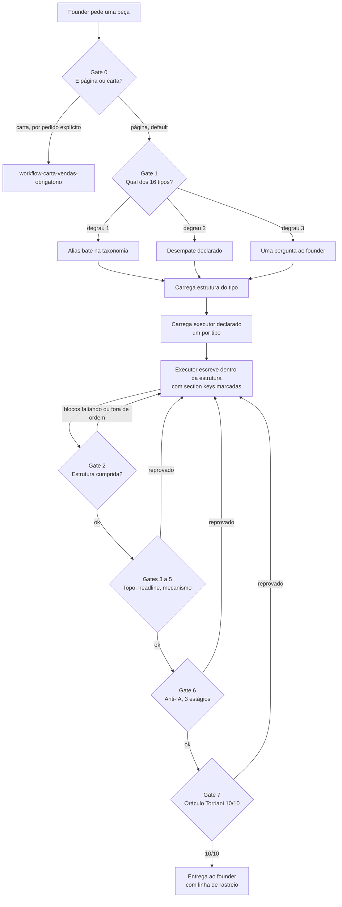

# Workflow: Produção de Página

```yaml
workflow:
  name: wf-producao-pagina
  description: "Workflow mestre de produção de página. Serve aos 16 tipos da taxonomia."
  versao: "1.0.0"
  criado_em: "2026-08-22"
  origem: "Pipeline SINKRA, processo estruturas-de-pagina-squad-copy, Fases 1 a 3"
  complexidade: alta
  status: ATIVO

irmao:
  carta: "workflows/workflow-carta-vendas-obrigatorio.md"
  nota: "Carta e página são workflows diferentes. Escolher errado é a falha que este workflow existe para impedir."
```

---

## A regra que governa tudo

**Formato antes de voz.**

Uma carta perfeita na voz do Torriani passa 10/10 no Oráculo e continua sendo a peça errada. Validar voz antes de validar formato é gastar rigor no lugar errado.

---

## Por que este workflow existe

O roteamento do squad decidia por três eixos: preço, temperatura de tráfego e copywriter. **Formato de peça: zero eixos.** O match era por string de nome.

Resultado documentado: pedido de página rodava `create-sales-page.md`, que apesar do nome entrega carta. O founder reprovou em 22/08/2026, duas vezes.

A causa está escrita dentro do próprio agente: `agents/tier-2-executores/gary-halbert.md` linha 69 descreve o comando `*sales-page` como "criar carta de vendas completa".

---

## Diagrama do fluxo



Sem ciclos entre gates. Toda reprovação volta ao mesmo ponto, a escrita, nunca a um gate anterior.

---

## As fases

### Fase 0: Gate de família

**Pergunta:** é página ou é carta?

```bash
node scripts/resolver-formato.mjs --pedido "<o pedido do founder>"
```

| | |
|---|---|
| Quem decide | `scripts/resolver-formato.mjs`, lendo `data/estruturas/taxonomia-paginas.yaml` |
| Checklist de apoio | `checklists/carta-vs-pagina.md` |
| Executor do gate | Worker. `claude-hopkins` entra depois, na Fase 4 |
| Default | página |
| Carta | só por pedido explícito, via `--carta-explicita` |
| Exit codes | `0` liberado, `1` tipo não canônico, `2` erro ou ambiguidade |

O script resolve as Fases 0 e 1 numa chamada só: família, tipo, executor, estrutura e checklists. A saída em `--json` é o contrato de formato que trava o resto do fluxo.

**Veto:** avançar sem família definida.

**A trava:** decidida a família, ela **não pode ser revertida** pelo executor nem pela task. Isso fecha a porta da fase 3.1 do `create-sales-page.md`, que escolhe formato por awareness level e tem "Sales Letter" em dois dos cinco resultados.

---

### Fase 1: Gate de tipo

**Pergunta:** qual dos 16?

| | |
|---|---|
| Fonte | `data/estruturas/taxonomia-paginas.yaml` |
| Como decide | `checklists/estrutura-pagina.md`, Gate 1, três degraus |
| Default sem qualificar | `pagina-vendas-perpetuo` |

Três degraus, nesta ordem: o alias bate, o desempate declarado resolve, uma pergunta em último caso.

**Veto:** avançar sem tipo definido. Peça sem tipo vira carta por inércia.

---

### Fase 2: Carga

Carrega, do tipo decidido:

- A estrutura, em `data/estruturas/{tipo}.md`
- O executor declarado na taxonomia, um por tipo
- Os checklists declarados
- `data/manual-craft.md`, piso de qualidade, sempre

**Veto:** executor escrever antes da estrutura carregada.

---

### Fase 3: Escrita

O executor escreve **dentro** da estrutura, com os marcadores `<!-- sectionKey -->` conforme `data/section-contract.md`.

**Reprova quem** entrega blocos soltos com transição colada depois. Bloco tem que puxar o próximo.

---

### Fase 4: Gates de formato

Na ordem, todos de `checklists/estrutura-pagina.md`:

| Gate | Verifica | Reprova |
|---|---|---|
| 2 | Blocos presentes, na ordem, section keys marcadas | Ordem de outro tipo, bloco inventado sem justificativa |
| 3 | Mecanismo com bloco próprio | Metodologia diluída dentro de features |

**Fronteira R6:** o teste dos 3 segundos e a headline clonada NÃO moram no `estrutura-pagina.md`. Moram no `carta-vs-pagina.md` e rodam logo depois. Os dois gates precisam permanecer dois, senão a ordem entre eles some.

**Executor dos gates:** `claude-hopkins`, que se autodeclara auditor final antes de publicar.

---

### Fase 5: Gate anti-IA

Três estágios, nesta ordem:

1. `bash legacy/[integração externa não empacotada] <arquivo>`
2. `node legacy/[integração externa não empacotada] <arquivo>`
3. Crítico LLM, 5 dimensões, alvo 100/100

---

### Fase 6: Gate de voz

`bash scripts/oraculo-precheck.sh <arquivo>` mais o Oráculo Torriani.

**10/10 ou refaz.** Sem exceção, cliente Torriani.

---

### Fase 7: Entrega

A peça vai ao founder com a linha de rastreio:

```
Tipo: {id do tipo}
Estrutura: data/estruturas/{tipo}.md
Agente: {executor}
Workflow: wf-producao-pagina
Gates: {resultado de cada um}
```

**Peça sem linha de rastreio não é revisada pelo founder.** Regra dele, registrada em 22/08/2026.

---

## Workflows derivados

**Nenhum tipo precisa de workflow próprio.** Os 16 herdam este mestre com parametrização, porque o que muda entre eles é a estrutura carregada na Fase 2 e o executor, não a sequência de fases.

**A exceção declarada:** `pagina-diagnostico-sessao`, execução classificada como aberta pela Fase 3, por ausência total de artefato. Enquanto a estrutura não existir, esse tipo roda com uma fase adicional de descoberta antes da Fase 2, derivando de `pagina-aplicacao`.

---

## As três frentes da Fase 3

| Frente | O que era | Estado |
|---|---|---|
| **F1** | Dois executores com confiança baixa (tipos 10 e 16) | Declarado na taxonomia. Tipo 10 tem execução aberta, tipo 16 herda de template órfão a plugar |
| **F2** | `checklists/estrutura-pagina.md` citado em 15 de 16 linhas e não existia | **Resolvido em 2026-08-22.** Criado com 5 gates |
| **F3** | Banco de headline sem etiqueta de peça | **Tratado em 2026-08-22.** `headlines-ganchos.md` ganhou `origem_de_peca: carta`, `destino_ausente` e `familias_proibidas_em_pagina`. Headline puxada de lá para página passa obrigatoriamente pelo Gate 3 |

---

## Ordem de implementação dos 16 tipos

Respeita as dependências dos handoffs da Fase 3.

| Onda | Tipos | Por quê |
|---|---|---|
| 1 | `pagina-vendas-perpetuo` | É o default. Fonte do founder já versionada. **Feito em 2026-08-22** |
| 2 | `pagina-aplicacao` | Bloqueia o tipo de prioridade máxima |
| 3 | `pagina-diagnostico-sessao` | **Prioridade máxima do founder.** Depende da onda 2 |
| 4 | `pagina-vendas-evento` | Depende do tipo 1. É o tipo da reprovação de 22/08 |
| 5 | `pagina-captura`, `pagina-registro-evento`, `pagina-lista-espera` | Já quase prontos, custo baixo |
| 6 | `pagina-comparacao`, `pagina-garantia` | Templates órfãos, só plugar |
| 7 | `pagina-downsell`, `pagina-obrigado`, `pagina-vendas-oto` | Extrair de tasks existentes |
| 8 | `pagina-vendas-geral`, `pagina-vendas-tripwire`, `pagina-vsl`, `pagina-vendas-lancamento` | Consolidar, derivar, formalizar, traduzir |

---

## Critério de pronto por tipo

Um tipo só é declarado operacional quando **todos os cinco** existem:

- [ ] Estrutura escrita em `data/estruturas/{tipo}.md`, com proveniência declarada
- [ ] Executor confirmado, existente no disco, um só
- [ ] Checklists declarados e existentes
- [ ] Aliases registrados na taxonomia
- [ ] Uma peça real produzida e aprovada pelo founder

**Enquanto os cinco não fecharem**, o `status` na taxonomia diz o que falta.

---

## Veto conditions globais

- Avançar sem família definida (Fase 0)
- Avançar sem tipo definido (Fase 1)
- Executor escrever antes de carregar a estrutura
- Executor ou task reverter a família decidida
- Rodar Oráculo antes dos gates de formato
- Entregar sem os marcadores de section key
- Entregar sem a linha de rastreio
